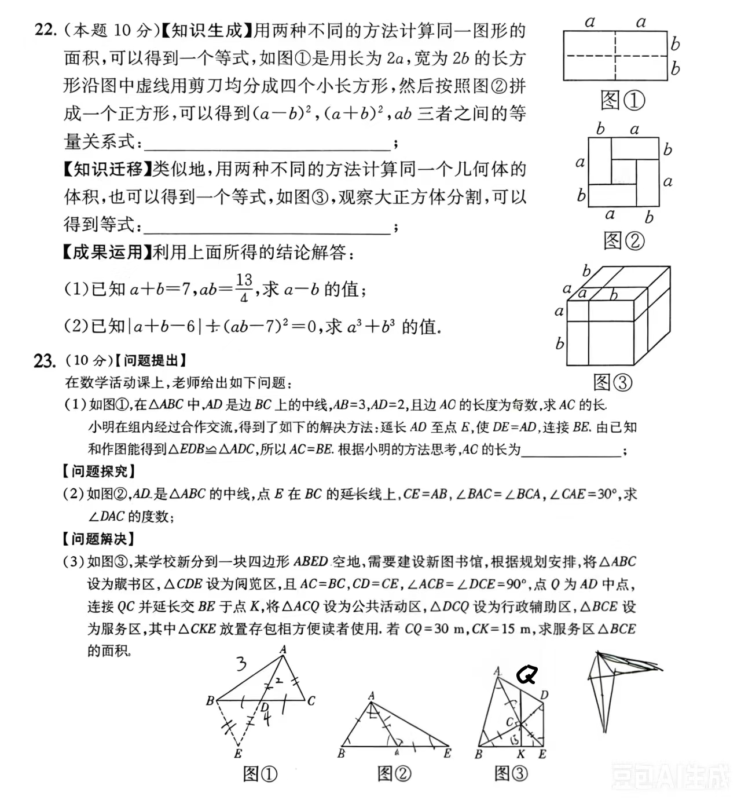

# Math Error Handout

Codex Skill：根据初中数学题目图片生成中文错题复盘 Word 讲义，支持重画干净图形、步骤填空、易错点诊断、同类变式和答案解析。

这个 Skill 适合老师、家长和学生把数学错题图片整理成可打印的 Word 复习讲义。默认输出为学生练习版，答案统一放在文末，方便课堂打印和课后订正。

## 功能特点

- 识别数学题图片、PDF、文字或 Word 文档中的题目内容
- 按年级、学期、地区和教材版本判断是否超纲
- 原图有手写痕迹时，重画干净示意图
- 自动生成思路提示、易错点诊断、作答区和步骤填空
- 自动生成同类变式题和混合巩固练习
- 参考答案与解析统一放在文末
- 强制要求：原题有图，生成的 Word 中必须有实际图形，不能只写图形说明

## 效果展示

### 原题图片



### 生成效果

点击查看示例 PDF：

[Grade 7 Math Advanced Review 示例 PDF](./assets/demo-output.pdf)

## 使用方式

把本仓库中的 `math-error-handout` 文件夹放到 Codex 的 skills 目录中，例如：

```text
~/.codex/skills/math-error-handout
```

然后在 Codex 中这样调用：

```text
使用 $math-error-handout，根据这张初中数学题图片生成一份可打印 Word 错题复盘讲义。7下，山西运城，北师大版。
```

也可以直接说明：

```text
根据这张题图生成学生版错题讲义，要求有干净重画图、步骤填空、同类变式题和文末答案解析。
```

## 仓库结构

```text
math-error-handout/
├── SKILL.md
├── README.md
├── agents/
│   └── openai.yaml
├── references/
│   └── handout-standards.md
└── assets/
    ├── demo-original.jpg
    ├── demo-output.pdf
    ├── wechat-reward.jpg
    └── alipay-reward.jpg
```

## 适用场景

- 教师整理课堂错题讲义
- 家长给孩子制作专题复习材料
- 学生把错题拍照后转成可打印 Word
- 教培老师制作错题复盘、变式训练和专题拔高资料

## 支持作者

如果这个 Skill 对你有帮助，欢迎 Star，也欢迎打赏支持后续更新。

| 微信打赏 | 支付宝打赏 |
|---|---|
|  |  |

## 说明

本项目用于学习资料整理和教学辅助。生成内容仍建议由老师或家长进行人工复核，尤其是图片不清、条件缺失、图形关系复杂或可能超纲的题目。
